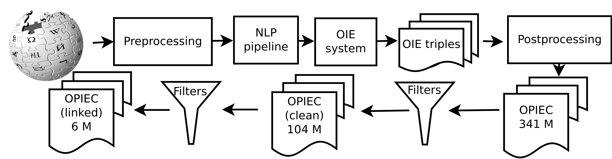

# OPIEC: An Open Information Extraction Corpus


* [Introcution](#introduction)
* [Pipeline](#pipeline)
   * [Preprocessing](#preprocessing)
   * [NLP Pipeline](#nlp-pipeline)
   * [OPIEC](#opiec)
   * [OPIEC-Clean and OPIEC-Linked](#opiec-clean-and-opiec-linked)
* [Citation](#citation)

## Introduction
OPIEC is an Open Information Extraction (OIE) corpus, consisted of more than 341M triples extracted from the entire English Wikipedia. Each triple from the corpus is consisted of rich meta-data: each token from the subj/obj/rel along with NLP annotations (POS tag, NER tag, ...), provenance sentence along with the dependency parse, original (golden) links from Wikipedia, sentence order, space/time, etc (for more detailed explanation of the meta-data, see [here](#metadata)). 

There are two major corpora released with OPIEC:

1. OPIEC: an OIE corpus containing hundreds of millions of triples.
2. WikipediaNLP: the entire English Wikipedia with NLP annotations.

For more details concerning the construction, analysis and statistics of the corpus, read the AKBC paper [*"OPIEC: An Open Information Extraction Corpus*"](https://arxiv.org/pdf/1904.12324.pdf). To download the data and get additional resources, please visit the [project page](https://www.uni-mannheim.de/dws/research/resources/opiec/). For reading the data, please visit the GitHub repository [OPIEC](https://github.com/uma-pi1/OPIEC).

## Pipeline 
<p align="center">
  
</p>

### Preprocessing

In this step, a Wikipedia dump is cleaned. With a [modified version](https://github.com/samuelbroscheit/wikiextractor-wikimentions) of the [Wikiextractor](https://github.com/attardi/wikiextractor), the plain text from Wikipedia articles is kept. In addition, the information about the links found within the articles is kept. The output of the previous step serves as input for the next: `src/main/py3/write_to_avro_demo.py`. This Python script will convert the Wikiextractor data into avro files with the schema `WikiArticleLinked`. 

### NLP Pipeline

The output from the preprocessing step (written in `WikiArticleLinked` format), is taken as an input for the NLP pipeline step. To run this, use the Apache Spark script `spark.wiki.linked.nlp.WikiArticleAnnotateNLPLinked`. This generates data about the articles' text and their NLP annotations (POS tags, NERs, dependency parse, ...). The data is written in the avro schema format `WikiArticleLinkedNLP` (we refer to this data as *"WikiNLP"*). 

### OPIEC

For generating OPIEC (sometimes referred to as *"OPIEC-Raw"*), the input from the previous step is needed (the WikiNLP dataset). OPIEC can be generated by running the script `spark.wiki.linked.triple.annotate.OPIEC`.

### OPIEC-Clean and OPIEC-Linked

To generate OPIEC-Clean / OPIEC-Linked, the corpus OPIEC-Raw is needed as an input. Then, from the package `spark.wiki.linked.triple.select` use OpiecClean / OpiecLinked respectively. 

## Citation

If you use any of these corpora, or use the findings from the paper, please cite: 

```
@inproceedings{gashteovski2019opiec,
  title={OPIEC: An Open Information Extraction Corpus},
  author={Gashteovski, Kiril and Wanner, Sebastian and Hertling, Sven and Broscheit, Samuel and Gemulla, Rainer},
  booktitle={Proceedings of the Conference on Automatic Knowledge Base Construction (AKBC)},
  year={2019}
}
```
